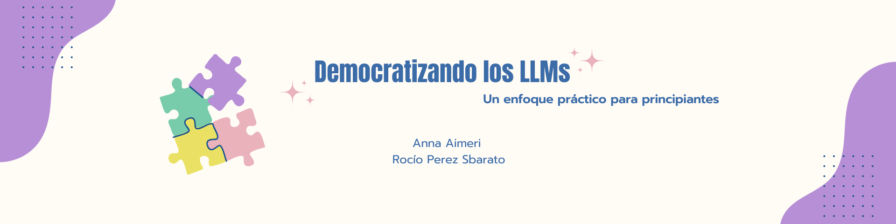

# Democratizando los LLMs: un enfoque práctico para principiantes

## Resumen

Este proyecto se enfoca en desarrollar notebooks interactivas accesibles para personas sin experiencia técnica, utilizando Google Colab y Jupyter sin necesidad de APIs de terceros. El objetivo es facilitar el fine-tuning/personalización de LLMs y el resumen automático de textos, permitiendo a los usuarios trabajar con conjuntos de datos propios manteniendo la privacidad. Se proporcionará un entorno pedagógico para el ajuste de hiperparámetros, preprocesamiento y evaluación sistemática de modelos, diseñado para facilitar la experimentación rápida con modelos de lenguaje avanzados sin necesidad de grandes infraestructuras.

## Hipótesis

La creación de notebooks interactivas y accesibles sobre LLMs permitirá a usuarios sin experiencia técnica:

1. Comprender y aplicar efectivamente técnicas de fine-tuning en modelos de lenguaje para tareas específicas como el resumen automático de textos.
2. Trabajar con sus propios conjuntos de datos de manera segura y privada, sin depender de APIs o servicios externos.
3. Experimentar y evaluar rápidamente la utilidad de los LLMs para sus necesidades específicas, fomentando una toma de decisiones informada sobre el uso de estas tecnologías.
4. Adquirir habilidades prácticas en el manejo de datasets, tokenización, entrenamiento y evaluación de modelos de lenguaje, superando las barreras de entrada tradicionalmente asociadas con estas tecnologías.

## Objetivos preliminares

1. Introducir a los usuarios en el uso de Hugging Face y las librerías necesarias para interactuar con modelos de lenguaje.
2. Enseñar a cargar y preprocesar datasets, incluyendo la tokenización de textos.
3. Capacitar a los usuarios para entrenar y hacer fine-tuning de un modelo LLM con sus propios datasets.
4. Proporcionar herramientas y metodologías para evaluar el rendimiento de los modelos ajustados.
5. Crear documentación clara y accesible para cada notebook.
6. Fomentar la interactividad mediante ejemplos prácticos y ejercicios.

## Relación entre la hipótesis y los objetivos iniciales y el estado final alcanzado

La relación entre las hipótesis, los objetivos y el resultado final del proyecto aún no puede evaluarse por completo, ya que no se han realizado pruebas con usuarios. Sin embargo, los avances logrados reflejan un cumplimiento significativo de los objetivos técnicos y pedagógicos. Las notebooks desarrolladas abordan las hipótesis iniciales, como facilitar el fine-tuning y el trabajo seguro con datasets privados, además de fomentar la experimentación y la toma de decisiones informada.

## Relación entre la planificación inicial y la ejecución efectiva

- **Planificación inicial:** 
  - Semana 1: Notebook 1 - Hugging Face y Librerías.
  - Semana 2: Notebook 2 - Datasets y Tokenización.
  - Semana 3: Notebook 3 - Entrenamiento y Prueba del Modelo Nuevo.
  - Semana 4: finalización de la tercera notebook.
  - Semana 5: formularios y pruebas con usuarios.
  - Semana 6: incorporación de devoluciones nuevas, pulido final de las notebooks y redacción del informe final.
  - Semana 7: revisión final y entrega.

No se han presentado desviaciones significativas, y el desarrollo avanzó según lo planificado. Los cambios han sido en relación al ritmo de trabajo. Particularmente, hemos trabajado en la documentación de los notebooks en paralelo con la implementación del código, anticipando el estado final de los mismos.
  
## Exploración de librerías y codebases

Las librerías / Codebases investigadas fueron Hugging Face (transformers, datasets), Google Colab, PyTorch.

Al final, Hugging Face fue seleccionada por su robustez y comunidad activa, lo que facilita su adopción por principiantes. Por su parte, Google Colab ofrece un entorno gratuito y fácil de usar para personas sin acceso a hardware especializado. Además, PyTorch fue elegido debido a su integración con Hugging Face y su flexibilidad en tareas de aprendizaje automático.

La estructura del codebase está orientada a la modularidad, separando claramente la carga de datasets, tokenización, y entrenamiento de modelos. En este proyecto la interactividad es clave, permitiendo a los usuarios modificar parámetros y observar los resultados de manera inmediata.

## Referencias

- [Using pretrained LLM for text classification](https://colab.research.google.com/drive/1h3hQ8anuKjoWJXz12p-OgwduBpYQB7rI?usp=sharing)
- [Taller: Modelos de lenguaje a tu medida](https://colab.research.google.com/github/nanom/llm_adaptation_workshop/blob/main/Taller_Modelos_de_lenguaje_a_tu_medida_13_de_septiembre_2023.ipynb)
- [Social Impacts of Artificial Intelligence](https://colab.research.google.com/drive/1bSo9oXpB7fHjPB5UZGKJAcyA0zXHGjZO?usp=sharing#scrollTo=7JMLkzn24hnm)
- [Hands On Large Language Models](https://github.com/HandsOnLLM/Hands-On-Large-Language-Models/tree/main)

## Devoluciones y comentarios de otros grupos

Los comentarios de otros grupos que recibimos plantearon que el proyecto es una propuesta interesante, pero es fundamental definir criterios específicos de éxito y las herramientas para medir la efectividad de los notebooks y la comprensión de los usuarios. Además, se sugirió aclarar el público objetivo y considerar la inclusión de recursos adicionales, como tutoriales y ejercicios prácticos, para enriquecer el aprendizaje y facilitar la comprensión de los LLMs.

Para abordar estas críticas, incluiremos recursos adicionales, principalmente de Jay Alammar, como tutoriales y ejercicios prácticos, ya que consideramos que estas mejoras son fundamentales para facilitar el aprendizaje y adaptar el contenido a las necesidades de los usuarios, especialmente aquellos sin experiencia previa. Además, se propuso la creación de formularios para recoger feedback sobre la experiencia del usuario.

### Evaluación del éxito del proyecto

Decidimos implementar **formularios de feedback** al final de cada notebook para que los usuarios puedan evaluar su experiencia, dificultades y comprensión de los conceptos. Estos formularios recogerán datos cuantitativos y cualitativos, que usaremos para ajustar las notebooks en la fase final.

El éxito del proyecto se medirá principalmente a través de preguntas abiertas y puntuales en torno a los siguientes ejes:
  - **Nivel de comprensión:** Evaluar si los usuarios pueden seguir los ejemplos y ejecutar las tareas propuestas sin mayor dificultad.
  - **Satisfacción del usuario:** Recoger opiniones sobre la claridad, utilidad y facilidad de uso de los notebooks.

## Trabajo futuro

Hemos alcanzado los objetivos planteados para esta instancia del trabajo. A lo largo de este proceso, hemos dejado a un lado algunas ideas y mejoras para nuestro proyecto. Si tuvieramos un equipo de cinco personas trabajando tiempo completo en este proyecto, nos abocaríamos a completar las tareas a continuación: 

- Seleccionar un par de modelos de generación de texto en español, que sean ligeros y adecuados para parametrizar los notebooks.  
- Realizar pruebas con usuarios y recopilar su retroalimentación para mejorar los contenidos y enfoques.  
- Adaptar el taller a las necesidades específicas de un cierto público objetivo, considerando que las expectativas y requerimientos varían entre grupos, como Ciencias Sociales o Ingeniería.  
- Incluir preguntas abiertas, de opción múltiple y/o de verdadero o falso, integrándolas entre los temas de los notebooks para reforzar el aprendizaje.  

## Conclusión

En el contexto del auge de la inteligencia artificial, consideramos que este proyecto ha tenido resultados positivos y valiosos. Nuestro objetivo es probar este trabajo con principiantes, posiblemente estudiantes de FaMAF, para obtener perspectivas que enriquezcan el desarrollo de los notebooks. Es un proceso gradual, ya que mejorar los notebooks requiere de retroalimentación directa por parte de los usuarios.  

A través de la participación en talleres de prueba y el análisis de las respuestas obtenidas en los formularios de feedback, aspiramos a convertir este recurso didáctico en una herramienta cada vez más completa y accesible. Además, hemos puesto a disposición de los usuarios diversos recursos complementarios que refuerzan los conceptos presentados en los notebooks.  

Nos mantendremos atentas a los notebooks interactivos que surjan en las comunidades de inteligencia artificial, ética y educación, integrando ideas y enfoques que puedan enriquecer esta propuesta educativa.
