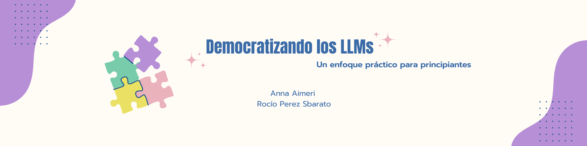

# Democratizando los LLMs: un enfoque práctico para principiantes

<!-- TOC start (generated with https://github.com/derlin/bitdowntoc) -->

- [Democratizando los LLMs: un enfoque práctico para principiantes](#democratizando-los-llms-un-enfoque-práctico-para-principiantes)
  - [Resumen](#resumen)
    - [Presentación del proyecto](#presentación-del-proyecto)
  - [Hipótesis](#hipótesis)
  - [Objetivos preliminares](#objetivos-preliminares)
  - [Relación entre la hipótesis y los objetivos iniciales y el estado final alcanzado](#relación-entre-la-hipótesis-y-los-objetivos-iniciales-y-el-estado-final-alcanzado)
  - [Relación entre la planificación inicial y la ejecución efectiva](#relación-entre-la-planificación-inicial-y-la-ejecución-efectiva)
  - [Exploración de librerías y codebases](#exploración-de-librerías-y-codebases)
  - [Referencias](#referencias)
  - [Devoluciones y comentarios de otros grupos](#devoluciones-y-comentarios-de-otros-grupos)
    - [Evaluación del éxito del proyecto](#evaluación-del-éxito-del-proyecto)
  - [Trabajo futuro](#trabajo-futuro)
    - [Objetivos e hipótesis](#objetivos-e-hipótesis)
    - [Tareas](#tareas)
  - [Relación con otras áreas de aprendizaje automática y procesamiento de lenguaje natural](#relación-con-otras-áreas-de-aprendizaje-automática-y-procesamiento-de-lenguaje-natural)
  - [Conclusión](#conclusión)

<!-- TOC end -->

<!-- TOC -->
## Resumen

Este proyecto se enfoca en desarrollar notebooks interactivas accesibles para personas sin experiencia técnica, utilizando Google Colab y Jupyter sin necesidad de APIs de terceros. El objetivo es facilitar el fine-tuning/personalización de LLMs y el resumen automático de textos, permitiendo a los usuarios trabajar con conjuntos de datos propios manteniendo la privacidad. Se proporcionará un entorno pedagógico para el ajuste de hiperparámetros, preprocesamiento y evaluación sistemática de modelos, diseñado para facilitar la experimentación rápida con modelos de lenguaje avanzados sin necesidad de grandes infraestructuras.

### Presentación del proyecto

Las filminas están disponibles en el repositorio en la carpeta `docs` bajo el nombre `presentación.pdf`. Recomendamos revisarlas para obtener una visión general rápida del proyecto.

<!-- TOC -->
## Hipótesis

La creación de notebooks interactivas y accesibles sobre LLMs permitirá a usuarios sin experiencia técnica:

1. Comprender y aplicar efectivamente técnicas de fine-tuning en modelos de lenguaje para tareas específicas como el resumen automático de textos.
2. Trabajar con sus propios conjuntos de datos de manera segura y privada, sin depender de APIs o servicios externos.
3. Experimentar y evaluar rápidamente la utilidad de los LLMs para sus necesidades específicas, fomentando una toma de decisiones informada sobre el uso de estas tecnologías.
4. Adquirir habilidades prácticas en el manejo de datasets, tokenización, entrenamiento y evaluación de modelos de lenguaje, superando las barreras de entrada tradicionalmente asociadas con estas tecnologías.

<!-- TOC -->
## Objetivos preliminares

1. Introducir a los usuarios en el uso de Hugging Face y las librerías necesarias para interactuar con modelos de lenguaje.
2. Enseñar a cargar y preprocesar datasets, incluyendo la tokenización de textos.
3. Capacitar a los usuarios para entrenar y hacer fine-tuning de un modelo LLM con sus propios datasets.
4. Proporcionar herramientas y metodologías para evaluar el rendimiento de los modelos ajustados.
5. Crear documentación clara y accesible para cada notebook.
6. Fomentar la interactividad mediante ejemplos prácticos y ejercicios.

<!-- TOC -->
## Relación entre la hipótesis y los objetivos iniciales y el estado final alcanzado

La relación entre las hipótesis, los objetivos y el resultado final del proyecto aún no puede evaluarse por completo, ya que no se han realizado pruebas con usuarios. Sin embargo, los avances logrados reflejan un cumplimiento significativo de los objetivos técnicos y didácticos. Las notebooks desarrolladas abordan los objetivos iniciales, como facilitar el fine-tuning y el trabajo seguro con datasets privados, además de fomentar la práctica y la exploración mediante ejemplos de código.

<!-- TOC -->
## Relación entre la planificación inicial y la ejecución efectiva

- **Planificación inicial:** 
  - Semana 1: Notebook 1 - Hugging Face y Librerías.
  - Semana 2: Notebook 2 - Datasets y Tokenización.
  - Semana 3: Notebook 3 - Entrenamiento y Prueba del Modelo Nuevo.
  - Semana 4: finalización de la tercera notebook.
  - Semana 5: formularios y pruebas con usuarios.
  - Semana 6: incorporación de devoluciones nuevas, pulido final de las notebooks y redacción del informe final.
  - Semana 7: revisión final y entrega.

No se han presentado desviaciones significativas, y el desarrollo avanzó según lo planificado. Los cambios han sido en relación al ritmo de trabajo. Particularmente, hemos trabajado en la documentación de los notebooks en paralelo con la implementación del código, anticipando el estado final de los mismos.
  
<!-- TOC -->
## Exploración de librerías y codebases

Las librerías / Codebases investigadas fueron Hugging Face (transformers, datasets), Google Colab, PyTorch.

Hugging Face fue seleccionada por su robustez y comunidad activa, lo que facilita su adopción por principiantes. Por su parte, Google Colab ofrece un entorno gratuito y fácil de usar para personas sin acceso a hardware especializado. Además, PyTorch fue elegido debido a su integración con Hugging Face y su flexibilidad en tareas de aprendizaje automático.

La estructura del codebase está orientada a la modularidad, separando claramente la carga de datasets, tokenización, y entrenamiento de modelos. En este proyecto la interactividad es clave, permitiendo a los usuarios modificar parámetros y observar los resultados de manera inmediata.

<!-- TOC -->
## Referencias

- [Using pretrained LLM for text classification](https://colab.research.google.com/drive/1h3hQ8anuKjoWJXz12p-OgwduBpYQB7rI?usp=sharing)
- [Taller: Modelos de lenguaje a tu medida](https://colab.research.google.com/github/nanom/llm_adaptation_workshop/blob/main/Taller_Modelos_de_lenguaje_a_tu_medida_13_de_septiembre_2023.ipynb)
- [Social Impacts of Artificial Intelligence](https://colab.research.google.com/drive/1bSo9oXpB7fHjPB5UZGKJAcyA0zXHGjZO?usp=sharing#scrollTo=7JMLkzn24hnm)
- [Hands On Large Language Models](https://github.com/HandsOnLLM/Hands-On-Large-Language-Models/tree/main)

<!-- TOC -->
## Devoluciones y comentarios de otros grupos

Los comentarios de otros grupos que recibimos plantearon que el proyecto es una propuesta interesante, pero es fundamental definir criterios específicos de éxito y las herramientas para medir la efectividad de los notebooks y la comprensión de los usuarios. Además, se sugirió aclarar el público objetivo y considerar la inclusión de recursos adicionales, como tutoriales y ejercicios prácticos, para enriquecer el aprendizaje y facilitar la comprensión de los LLMs.

Para abordar estas críticas, incluiremos recursos adicionales, principalmente de Jay Alammar, como tutoriales y ejercicios prácticos, ya que consideramos que estas mejoras son fundamentales para facilitar el aprendizaje y adaptar el contenido a las necesidades de los usuarios, especialmente aquellos sin experiencia previa. Además, se propuso la creación de formularios para recoger feedback sobre la experiencia del usuario.

<!-- TOC -->
### Evaluación del éxito del proyecto

Decidimos implementar formularios de feedback al final de cada notebook para que los usuarios puedan evaluar su experiencia, dificultades y comprensión de los conceptos. Estos formularios recogerán datos cuantitativos y cualitativos, que usaremos para ajustar las notebooks en la fase final.

El éxito del proyecto se medirá principalmente a través de preguntas abiertas y puntuales en torno a los siguientes ejes:
  - **Nivel de comprensión:** Evaluar si los usuarios pueden seguir los ejemplos y ejecutar las tareas propuestas sin mayor dificultad.
  - **Satisfacción del usuario:** Recoger opiniones sobre la claridad, utilidad y facilidad de uso de los notebooks.

<!-- TOC -->
## Trabajo futuro

Hemos alcanzado los objetivos planteados para esta instancia del trabajo. A lo largo de este proceso, hemos dejado a un lado algunas ideas y mejoras para nuestro proyecto. 
Si tuvieramos un equipo de cinco personas trabajando tiempo completo en este proyecto durante un año, nos abocaríamos a completar nuestros notebooks actuales y a sumar nuevos proyectos con objetivos similares.

### Objetivos e hipótesis
Sumados a los objetivos iniciales, los objetivos para la continuación del proyecto serían los siguientes:

1. Desarrollar talleres accesibles y personalizables para democratizar el uso de modelos de lenguaje natural.
2. Fomentar un aprendizaje interactivo y colaborativo.
3. Optimizar y evaluar el impacto del proyecto de forma continua.
4. Incorporar mejoras basadas en el feedback de usuarios, medir la efectividad de los talleres y realizar ajustes para maximizar su alcance y utilidad.
5. Investigar y minimizar la huella de carbono asociada al entrenamiento y uso de modelos, fomentando la sostenibilidad tecnológica.
6. Explorar oportunidades de impacto e inserción del proyecto en comunidades específicas.

Asimismo, sumadas a las hipótesis iniciales, consideramos que la creación de notebooks interactivas y accesibles sobre LLMs permitirá a usuarios sin experiencia técnica a

1. Colaborar y compartir conocimientos dentro de una comunidad en crecimiento, promoviendo el aprendizaje colectivo y la democratización del procesamiento de lenguaje natural.
2. Explorar el impacto ambiental del uso de LLMs y adoptar prácticas más sostenibles en sus proyectos.
3. Adaptar las herramientas y metodologías aprendidas a sus propios contextos, ampliando el alcance de los LLMs más allá de casos de uso de ejemplo.
4. Capacitar a equipos internos en el uso de estas herramientas, extendiendo el conocimiento adquirido a nivel organizacional y facilitando la integración de LLMs en procesos existentes.
5. Construir capacidades de autoaprendizaje, al proporcionarles plantillas y ejemplos que puedan modificar según nuevos desafíos.

### Tareas 

Además de las tareas inicialmente planteadas, proponemos las siguientes para la continuación del proyecto:

1. **Parametrizar la serie de notebooks realizados**  
   - Parametrizar mediante modelos preentrenados eficientes y optimizados para tareas de generación en español, garantizando accesibilidad y compatibilidad con equipos de bajo rendimiento.  

2. **Diseño de estrategias para recopilar feedback efectivo**  
   1. **Incorporación de preguntas interactivas para evaluar el aprendizaje**  
      - Añadir preguntas abiertas, de opción múltiple y verdadero o falso directamente en los notebooks para reforzar conceptos clave y evaluar la comprensión de los usuarios.  

3. **Integración de actividades colaborativas en los talleres**  
   - Proponer ejercicios grupales que fomenten la discusión, el análisis colectivo y la construcción de soluciones prácticas.  

4. **Iteración constante basada en feedback de usuarios**  
   - Después de cada mejora o adición de comentarios, realizar pruebas piloto para evaluar la efectividad de los cambios y ajustar los notebooks según las necesidades detectadas.  

5. **Monitoreo de impacto y adopción de los talleres**  
   1. **Definición de métricas claras de evaluación**  
      - Establecer indicadores para medir el alcance, efectividad y satisfacción de los participantes.  
   2. **Análisis de datos sobre el desempeño y utilidad de los talleres**  
      - Recopilar información cuantitativa y cualitativa para identificar puntos fuertes y áreas de mejora.  
   3. **Iteraciones continuas en función de los resultados obtenidos**  
      - Refinar los contenidos y estrategias de los talleres basándose en datos recopilados antes de su implementación general.  

6. **Contabilizar la huella de carbono del desarrollo y el uso de los talleres**
   - Explorar y analizar el impacto ambiental generado durante el desarrollo, implementación y uso de los talleres, considerando tanto el consumo energético de los modelos como los recursos utilizados.

7. **Exploración de oportunidades para expandir la metodología**  
   - Identificar comunidades, instituciones o eventos donde estos talleres puedan ser útiles para democratizar el acceso al procesamiento de lenguaje natural.  

8. **Personalización de talleres para perfiles específicos**  
   - Diseñar contenidos adaptados a las necesidades y expectativas de hasta dos perfiles distintos, maximizando su utilidad.  
  1. **Creación de un módulo introductorio condensado**  
     - Proveer una introducción accesible para usuarios con menos experiencia técnica, basada en los tres primeros notebooks del proyecto inicial.  

9. **Definición de criterios de evaluación para talleres personalizados**  
   - Establecer parámetros para medir el éxito y la relevancia de los talleres diseñados a medida, como la retención de conocimientos o la capacidad de aplicarlos.  

10. **Creación de un repositorio centralizado de recursos y ejemplos prácticos**  
   - Organizar todos los talleres, notebooks y ejemplos aplicados en una plataforma accesible y bien estructurada para fomentar su reutilización.  

| Actividad                         | Mes 1 | Mes 2 | Mes 3 | Mes 4 | Mes 5 | Mes 6 | Mes 7 | Mes 8 | Mes 9 | Mes 10 | Mes 11 | Mes 12 |
|-----------------------------------|-------|-------|-------|-------|-------|-------|-------|-------|-------|--------|--------|--------|
| **Parametrización**               |   X   |   X   |       |       |       |       |       |       |       |        |        |        |
| **Actividades interactivas**      |   X   |   X   |       |       |       |       |       |   X   |   X   |   X    |        |        |
| **Monitoreo**                     |       |       |   X   |   X   |   X   |   X   |   X   |   X   |   X   |   X    |   X    |   X    |
| **Pruebas de proyecto inicial**   |       |       |   X   |   X   |   X   |   X   |   X   |   X   |       |        |        |        |
| **Huella de carbono**             |       |       |   X   |   X   |   X   |   X   |   X   |   X   |   X   |   X    |   X    |   X    |
| **Exploración**                   |       |       |       |       |   X   |   X   |   X   |       |       |        |        |        |
| **Módulo introductorio**          |       |       |       |       |   X   |   X   |       |       |       |        |        |        |
| **Criterios de éxito**            |       |       |       |       |       |       |   X   |   X   |       |        |        |        |
| **Adaptación**                    |       |       |       |       |       |       |   X   |   X   |   X   |        |        |        |
| **Talleres hechos a medida**      |       |       |       |       |       |       |       |       |   X   |   X    |   X    |   X    |
| **Repositorio centralizado**      |       |       |       |       |       |       |       |   X   |   X   |        |        |        |

<!-- TOC -->
## Relación con otras áreas de aprendizaje automático y procesamiento de lenguaje natural 

Nuestro proyecto, al tener objetivos didácticos e introductorios, conecta diversas áreas clave del aprendizaje automático y el procesamiento del lenguaje natural:

1. Técnicas fundamentales de PLN: Abarcamos tareas esenciales como análisis de sentimientos, generación y traducción de texto, además de prácticas fundamentales como el preprocesamiento y la tokenización. La exposición a estas tareas proporciona una base sólida para comprender aplicaciones más avanzadas.
2. Transfer Learning y Fine-tuning: Utilizamos técnicas de fine-tuning para adaptar modelos preentrenados, lo que sirve como introducción práctica al aprendizaje por transferencia, un concepto fundamental en el aprendizaje profundo.
3. Optimización y Evaluación: Incorporamos métodos de evaluación de modelos y métricas de rendimiento, conectando con principios fundamentales de machine learning.
4. Representación del Conocimiento: Al trabajar con LLMs, introducimos conceptos de embeddings y representaciones vectoriales del lenguaje, fundamentales para comprender cómo las máquinas procesan e interpretan el texto.
5. Ética y Privacidad en IA: Promovemos prácticas éticas trabajando con datos locales y brindando un enfoque responsable de la IA, conectando con discusiones actuales sobre privacidad y seguridad en el campo.
6. Democratización Tecnológica: Facilitamos el acceso a estas herramientas mediante Hugging Face y notebooks interactivos, relacionándonos con esfuerzos más amplios en la comunidad de IA para hacer estas tecnologías más accesibles.

<!-- TOC -->
## Conclusión

En el contexto del auge de la inteligencia artificial, consideramos que este proyecto ha tenido resultados positivos y valiosos. Nuestro objetivo es probar este trabajo con principiantes, posiblemente estudiantes de FaMAF, para obtener perspectivas que enriquezcan el desarrollo de los notebooks. Es un proceso gradual, ya que mejorar los notebooks requiere de retroalimentación directa por parte de los usuarios.  

A través de la participación en talleres de prueba y el análisis de las respuestas obtenidas en los formularios de feedback, aspiramos a convertir este recurso didáctico en una herramienta cada vez más completa y accesible. Además, hemos puesto a disposición de los usuarios diversos recursos complementarios que refuerzan los conceptos presentados en los notebooks.  

Nos mantendremos atentas a los notebooks interactivos que surjan en las comunidades de inteligencia artificial, ética y educación, integrando ideas y enfoques que puedan enriquecer esta propuesta educativa.

